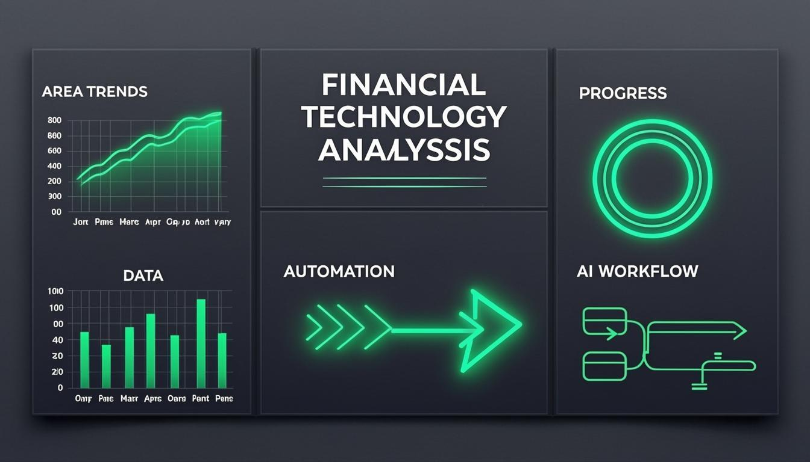

<div align="center">

# NEXUS

**Agentic Intelligence for Finance**

[](https://github.com/mellowedbo/RAG-PROJECT)
[](https://nextjs.org/)
[](https://www.typescriptlang.org/)
[](https://ai.google.dev/)
[](LICENSE)

</div>

---

A multi-agent RAG platform for financial document analysis. Upload 10-K filings, earnings reports, or risk assessments, ask a question in plain language, and a four-agent pipeline retrieves, ranks, reasons over, and synthesizes a citation-grounded answer.

> **Demo mode** ships with 3 sample documents (Tesla 10-K, Goldman Sachs Q4 earnings, JP Morgan risk assessment). No setup required. **Test mode** lets you upload your own files. All data persists in localStorage — no database server, no config files.

---

## Preview



---

## Features

### RAG Pipeline

- **4-agent architecture** — Ingestion, Retrieval, Reasoning, and Synthesis agents with defined input/output contracts
- **Section-aware chunking** — Splits on SEC filing boundaries (`ITEM 1A`, `PART II`), paragraph breaks, and sentence boundaries with 80-word context overlap
- **TF-IDF retrieval** with finance-specific section-heading bonus (1.5x multiplier) and stop-word filtering
- **Embedding support** — Gemini Embedding 2 (up to 3072 dimensions, adjustable output, task-type optimization)
- **Compliance scanner** — 30+ pattern detectors across SEC Reg S-K, SOX, FCPA, OFAC, GDPR, Basel III, and ASC standards
- **Real-time agent trace** — Watch each pipeline step execute with timing and output details
- **Citation-grounded responses** — Every factual claim tagged with `[Source X]` notation mapping to specific chunks

### Financial Tools

- **Accounting** — Double-entry journal system, natural language entry parsing, trial balance generation, issue detection, offline analysis with health scoring
- **Tax** — Income tax calculator (Old/New regime comparison), GST computation (CGST/SGST/IGST), TDS reference tables, offline tax guidance with deduction checklists
- **Analysis** — Financial ratio calculator (liquidity, profitability, leverage, efficiency, market), benchmark comparison, offline SWOT generation from computed ratios, RAG-powered document analysis

### AI Integration

- **Gemini model family** — 2.0 Flash (recommended default), 1.5 Flash, 1.5 Pro, 2.5 Flash/Pro (preview), Gemma 3 variants
- **Automatic fallback chains** — If the selected model is unavailable (400/403/404), the system tries fallback models in sequence before returning an error
- **Thinking mode support** — Gemini 2.5 models' thought channel is handled transparently
- **Offline mode** — All financial tools work without an API key using local computation and rule-based analysis

### Deployment

- **Vercel-ready** — Deploys on the free tier with zero configuration
- **localStorage-first** — No database server required for typical use; data persists across sessions in the browser
- **Free-tier operation** — Gemini 2.0 Flash + Vercel free tier + localStorage = $0/month
- **Google Colab notebook** — Complete Python pipeline for zero-install execution

---

## Architecture

```
                         NEXUS AGENTIC PIPELINE

 ┌─────────────┐     ┌─────────────┐     ┌─────────────┐     ┌─────────────┐
 │  INGESTION   │────>│  RETRIEVAL   │────>│  REASONING   │────>│  SYNTHESIS   │
 │   AGENT      │     │   AGENT      │     │   AGENT      │     │   AGENT      │
 ├─────────────┤     ├─────────────┤     ├─────────────┤     ├─────────────┤
 │ Section      │     │ TF-IDF       │     │ Top-K        │     │ Gemini LLM   │
 │ Boundary     │     │ Scoring      │     │ Selection    │     │              │
 │ Detection    │     │              │     │              │     │ Citation     │
 │ Semantic     │     │ Section      │     │ Confidence   │     │ Grounded     │
 │ Chunking     │     │ Heading      │     │ Scoring      │     │ Analysis     │
 │              │     │ Bonus        │     │              │     │              │
 │ Context      │     │ Stop-Word    │     │ Relevance    │     │ Structured   │
 │ Overlap      │     │ Filtering    │     │ Ranking      │     │ Output       │
 └─────────────┘     └─────────────┘     └─────────────┘     └─────────────┘
       │                    │                    │                    │
  Raw Document          Scored              Top-K Chunks       Citation-
  → Chunks              Chunks             + Confidence        Grounded
                                           Score              Response

 ┌──────────────────────────────────────────────────────────────────────────┐
 │  COMPLIANCE SCANNER (Parallel Agent)                                     │
 │                                                                          │
 │  Pattern matching: SEC Reg S-K │ SOX §404 │ FCPA │ OFAC │ GDPR │ ASC    │
 │  Output: Severity-classified findings (Critical / High / Medium / Low)   │
 └──────────────────────────────────────────────────────────────────────────┘
```

The pipeline is designed for observability. When a query returns a poor result, the agent trace shows exactly which stage failed — was the chunking wrong, the retrieval weak, the ranking off, or the synthesis hallucinating? Each agent has a single responsibility and a defined input/output contract.

---

## Tech Stack

| Component | Technology | Purpose |
|-----------|-----------|---------|
| Framework | Next.js 16 (App Router) | Server rendering, API routes, React Server Components |
| Language | TypeScript 5 | Type safety across agent pipeline contracts |
| Styling | Tailwind CSS 4 + shadcn/ui | Production-quality, accessible components |
| LLM | Google Gemini 2.0 Flash | Default generation model — free tier, low latency |
| Embeddings | Gemini Embedding 2 | 3072-dim vectors, adjustable output, task-type support |
| Charts | Recharts | Analytics dashboards |
| Animations | Framer Motion | Transitions and motion |
| State | Zustand + TanStack Query | Client and server state management |
| Database | Prisma (SQLite) | Server-side document and chunk persistence |
| Deployment | Vercel | Zero-config deploy, free tier |
| Python | Google Colab | Zero-install pipeline execution |

---

## Getting Started

### Prerequisites

- **Node.js 18+** or [Bun](https://bun.sh/)
- **A free [Google Gemini API key](https://aistudio.google.com/apikey)** (optional — offline mode works without one)

### Installation

```bash
# Clone the repository
git clone https://github.com/mellowedbo/RAG-PROJECT.git
cd RAG-PROJECT

# Install dependencies
npm install

# Start the development server
npm run dev
```

Open `http://localhost:3000`. The platform auto-seeds with 3 sample financial documents on first load — you can start querying immediately in Demo mode.

To analyze your own documents, switch to Test mode and upload files directly through the browser. Supported formats: `.txt`, `.md`, `.pdf`, `.docx`.

### Environment Setup

Create a `.env.local` file in the project root:

```env
GEMINI_API_KEY=your_api_key_here
DATABASE_URL="file:./dev.db"
```

Get a free Gemini API key at [Google AI Studio](https://aistudio.google.com/apikey) — no credit card required. The API key is also configurable from the Settings tab inside the app, so the `.env.local` file is optional.

---

## Configuration

### Model Selection

Configure models from the **Settings** tab. Defaults:

| Setting | Default | Options |
|---------|---------|---------|
| Generation model | `gemini-2.0-flash` | Gemini 2.0 Flash, 2.0 Flash Lite, 1.5 Flash, 1.5 Pro, 2.5 Flash/Pro (preview), Gemma 3 (27B/12B/4B) |
| Embedding model | `gemini-embedding-2` | Gemini Embedding 2, Embedding Exp 03-07, text-embedding-004 |
| Embedding dimensions | 768 | 128–3072 (Gemini Embedding 2 only) |
| Embedding task type | `RETRIEVAL_DOCUMENT` | `RETRIEVAL_QUERY`, `RETRIEVAL_DOCUMENT`, `SEMANTIC_SIMILARITY`, `CLASSIFICATION`, `CLUSTERING` |

### Pipeline Parameters

| Parameter | Default | Description |
|-----------|---------|-------------|
| Chunk size | 800 | Maximum words per chunk |
| Chunk overlap | 120 | Overlap words between adjacent chunks |
| Top-K | 8 | Number of chunks passed to the LLM |
| Use embeddings | true | Enable vector search alongside TF-IDF |
| Simulation mode | false | Skip LLM calls, return retrieval-only results |

### Fallback Chains

When a model returns 400/403/404 (unavailable in region, deprecated, etc.), the system automatically tries fallback models:

```
gemini-2.5-pro-preview  →  gemini-2.5-flash-preview  →  gemini-2.0-flash  →  gemini-1.5-flash
gemini-2.5-flash-preview  →  gemini-2.0-flash  →  gemini-1.5-flash
gemini-2.0-flash  →  gemini-1.5-flash  →  gemini-2.0-flash-lite
gemini-1.5-pro  →  gemini-1.5-flash  →  gemini-2.0-flash
gemma-3-*  →  gemini-2.0-flash  →  gemini-1.5-flash
```

The response includes `X-Model-Used` and `X-Model-Fallback` headers so the UI can indicate when a fallback was used.

---

## Module Documentation

### Dashboard

Overview of pipeline activity: query history, document stats, compliance findings summary, and performance metrics (average retrieval/synthesis latency, confidence scores).

### Documents

Upload, manage, and inspect financial documents. Each document is automatically chunked and indexed. Shows chunk count, word count, section structure, and processing status.

### Query

The core RAG interface. Enter a natural language question, select target documents, and watch the four-agent pipeline execute in real time. Results include the synthesized answer, cited source chunks with relevance scores, and end-to-end latency metrics.

### Accounting

Double-entry bookkeeping with journal entry creation (manual or natural language parsing), trial balance generation, issue detection (unbalanced entries, missing narrations, unusual amounts), and AI-powered or offline analysis.

### Tax

Income tax calculator with Old vs. New regime comparison, GST computation (CGST/SGST/IGST with inclusive/exclusive options), TDS reference tables, and an AI tax assistant that works offline with pre-built deduction checklists and regime guidance.

### Analysis

Financial ratio calculator covering liquidity, profitability, leverage, efficiency, and market ratios. Includes benchmark comparison, RAG-powered analysis that pulls financial figures from uploaded documents, and offline SWOT generation based on computed ratios.

### Colab

Download a pre-built Google Colab notebook (`nexus_agentic_rag_colab.py`) that runs the same agentic pipeline in Python. Zero installation — paste your document text and query it using Gemini 2.0 Flash.

### Settings

Configure API key, generation/embedding models, pipeline parameters (chunk size, overlap, Top-K), and manage stored data (clear documents, reset configuration).

---

## Vercel Deployment

### Step 1: Fork or Clone

```bash
# Option A: Fork on GitHub, then clone your fork
git clone https://github.com/YOUR_USERNAME/RAG-PROJECT.git

# Option B: Clone directly and push to your own repo
git clone https://github.com/mellowedbo/RAG-PROJECT.git
cd RAG-PROJECT
git remote set-url origin https://github.com/YOUR_USERNAME/YOUR_REPO.git
git push -u origin main
```

### Step 2: Connect to Vercel

1. Go to [vercel.com](https://vercel.com) and sign in with your GitHub account
2. Click **"Add New..."** → **"Project"**
3. Select your repository from the list
4. Vercel auto-detects the Next.js framework — no configuration needed

### Step 3: Set Environment Variables

In the Vercel project settings, go to **Settings → Environment Variables** and add:

| Variable | Value | Required |
|----------|-------|----------|
| `GEMINI_API_KEY` | Your Google Gemini API key | No (offline mode works without it) |
| `DATABASE_URL` | `file:./dev.db` | No (defaults to SQLite) |

To add variables:

1. Navigate to **Settings → Environment Variables**
2. Enter the variable name and value
3. Select the environments: **Production**, **Preview**, and **Development**
4. Click **Save**
5. Redeploy for changes to take effect

### Step 4: Deploy

Click **Deploy**. Vercel runs `next build` and deploys the output. The first deploy typically takes 2–3 minutes.

The included `vercel.json` configures:

- Framework detection: `nextjs`
- Build command: `next build`
- Region: `sin1` (Singapore)
- API route headers: `Cache-Control: no-store`

### Step 5: Custom Domain (Optional)

1. Go to **Settings → Domains**
2. Add your domain (e.g., `nexus.yourdomain.com`)
3. Configure DNS at your registrar:
   - **A record**: `76.76.21.21` (Vercel's IP)
   - **CNAME record**: `cname.vercel-dns.com` (for subdomains)
4. Vercel provisions an SSL certificate automatically

### Notes on Serverless Deployment

- **Rate limiting** uses in-memory storage, which resets on serverless cold starts. This is acceptable for demo and low-traffic use.
- **localStorage** is client-side only. On Vercel, documents uploaded in the app are persisted in the browser, not on the server. For server-side persistence, the app uses Prisma with SQLite — but note that SQLite on Vercel's ephemeral filesystem resets on each deployment.
- For production multi-user scenarios, consider switching the Prisma provider to PostgreSQL (e.g., Vercel Postgres or Supabase) and updating `DATABASE_URL` accordingly.

---

## API Reference

### Gemini Proxy

```
POST /api/gemini
```

Proxies requests to the Gemini API with fallback chain support.

| Parameter | Type | Description |
|-----------|------|-------------|
| `apiKey` | string | Gemini API key |
| `mode` | `"generate" \| "embed"` | Operation mode |
| `model` | string | Model ID (default: `gemini-2.0-flash`) |
| `systemPrompt` | string | System instruction (generate mode) |
| `userPrompt` | string | User message (generate mode) |
| `texts` | string[] | Texts to embed (embed mode) |
| `outputDimensionality` | number | Embedding dimensions, 128–3072 |
| `taskType` | string | Embedding task type |

Response headers: `X-Model-Used`, `X-Model-Fallback`, `X-RateLimit-Remaining`.

### File Extraction

```
POST /api/extract
```

Extracts text from uploaded files. Accepts `multipart/form-data` with a `file` field. Supported formats: `.txt`, `.md`, `.pdf`, `.docx`.

Returns: `{ text, filename, chars, words }`

### Finance Query

```
POST /api/finance-query
```

Runs the full RAG pipeline against stored documents.

| Parameter | Type | Description |
|-----------|------|-------------|
| `query` | string | Natural language question |
| `documentIds` | string[] | Target document IDs (optional, all if omitted) |
| `domain` | string | Analysis domain (default: `"finance"`) |

Returns: `{ response, agentTrace, metrics, citedChunks }`

### Compliance Scan

```
POST /api/compliance-scan
```

Scans document chunks for regulatory compliance findings.

| Parameter | Type | Description |
|-----------|------|-------------|
| `documentIds` | string[] | Target document IDs (optional) |

Returns: `{ findings, summary, stats, categories }`

### Seed Database

```
POST /api/seed
```

Seeds the database with 3 sample financial documents (Tesla 10-K, Goldman Sachs earnings, JP Morgan risk assessment). Idempotent — returns a message if documents already exist.

```
DELETE /api/seed
```

Wipes all documents, chunks, and analysis sessions.

### Documents

```
GET /api/documents/list
```

Lists all documents with stats (chunk counts, word counts, type breakdown).

```
DELETE /api/documents/delete?id=<document_id>
```

Deletes a document and its chunks.

---

## Offline Mode

NEXUS is designed to be useful even without a Gemini API key. Here's what works offline:

| Feature | Offline Behavior |
|---------|-----------------|
| Document upload & chunking | Full functionality |
| TF-IDF retrieval | Full functionality |
| Compliance scanner | Full functionality |
| Query (retrieval only) | Returns top chunks with relevance scores, no LLM synthesis |
| Accounting analysis | Rule-based health score, trial balance assessment, issue detection |
| Tax assistant | Pre-built deduction checklists, regime comparison, GST/TDS reference tables |
| Financial analysis | Rule-based SWOT from computed ratios, benchmark comparison |
| Embedding search | Requires API key |

When no API key is configured, the UI shows an "Offline" badge and buttons display context-appropriate labels (e.g., "Analyze (Offline)" instead of "Analyze with AI"). Adding a Gemini API key in Settings upgrades all tools to AI-powered mode.

---

## Project Structure

```
RAG-PROJECT/
├── prisma/
│   └── schema.prisma              # Database schema (Document, DocumentChunk, AnalysisSession)
├── public/
│   ├── logo.svg                   # NEXUS favicon
│   ├── dashboard-preview.png      # Dashboard screenshot
│   ├── hero-bg.png                # Landing background
│   ├── network-bg.png             # Network visualization background
│   └── downloads/
│       └── nexus_agentic_rag_colab.py  # Colab notebook
├── src/
│   ├── app/
│   │   ├── layout.tsx             # Root layout, theme provider, metadata
│   │   ├── page.tsx               # Main application page
│   │   ├── globals.css            # Global styles
│   │   └── api/
│   │       ├── route.ts           # Health check
│   │       ├── gemini/route.ts    # Gemini proxy with fallback chain
│   │       ├── extract/route.ts   # File text extraction
│   │       ├── finance-query/route.ts  # RAG pipeline endpoint
│   │       ├── compliance-scan/route.ts # Compliance scanner
│   │       ├── seed/route.ts      # Database seeding
│   │       └── documents/
│   │           ├── list/route.ts  # Document listing
│   │           └── delete/route.ts # Document deletion
│   ├── components/
│   │   ├── DashboardView.tsx      # Dashboard tab
│   │   ├── DocumentsView.tsx      # Document management tab
│   │   ├── QueryView.tsx          # RAG query interface tab
│   │   ├── AccountingView.tsx     # Accounting tools tab
│   │   ├── TaxView.tsx            # Tax calculator tab
│   │   ├── AnalysisView.tsx       # Financial analysis tab
│   │   ├── ComplianceView.tsx     # Compliance findings tab
│   │   ├── ColabView.tsx          # Colab notebook tab
│   │   ├── SettingsView.tsx       # Configuration tab
│   │   ├── Navigation.tsx         # Top nav bar with mode toggle
│   │   ├── ErrorBoundary.tsx      # React error boundary
│   │   └── ui/                    # shadcn/ui components
│   ├── hooks/
│   │   ├── useRAGPipeline.ts      # RAG pipeline orchestration hook
│   │   ├── use-mobile.ts          # Mobile detection
│   │   └── use-toast.ts           # Toast notifications
│   ├── lib/
│   │   ├── chunker.ts             # Text chunking (client-side)
│   │   ├── retriever.ts           # TF-IDF retrieval engine
│   │   ├── embeddings.ts          # Embedding generation
│   │   ├── compliance.ts          # Compliance scanning (client-side)
│   │   ├── storage.ts             # localStorage persistence layer
│   │   ├── demoData.ts            # Sample document data
│   │   ├── rateLimit.ts           # Server-side rate limiter
│   │   ├── db.ts                  # Prisma client instance
│   │   ├── utils.ts               # Utility functions
│   │   ├── vectordb/
│   │   │   ├── index.ts           # Vector DB interface
│   │   │   └── memory.ts          # In-memory vector store
│   │   └── rag/
│   │       ├── chunker.ts         # Server-side chunking with relevance scoring
│   │       └── compliance.ts      # Server-side compliance scanning
│   └── types/
│       └── index.ts               # Shared type definitions, model catalog, defaults
├── nexus_core/                    # Python implementation (Colab)
│   ├── __init__.py
│   ├── chunker.py
│   ├── retriever.py
│   ├── embeddings.py
│   ├── vectordb.py
│   ├── compliance.py
│   └── synthesizer.py
├── vercel.json                    # Vercel deployment config
├── package.json
├── tailwind.config.ts
├── tsconfig.json
└── next.config.ts
```

---

## Contributing

1. Fork the repository
2. Create a feature branch: `git checkout -b feature/your-feature`
3. Make changes and commit: `git commit -m "Add your feature"`
4. Push to your fork: `git push origin feature/your-feature`
5. Open a pull request

### Development

```bash
npm install          # Install dependencies
npm run dev          # Start dev server on port 3000
npm run lint         # Run ESLint
npm run db:push      # Push Prisma schema changes
```

### Code Style

- TypeScript throughout with strict typing
- shadcn/ui components for UI — don't build from scratch
- Follow the existing comment style (JSDoc for functions, `//` for inline notes)
- Keep the agent pipeline architecture intact — each agent has a single responsibility

---

## License

This project is licensed under the MIT License. See [LICENSE](LICENSE) for details.
